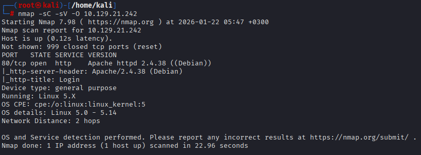
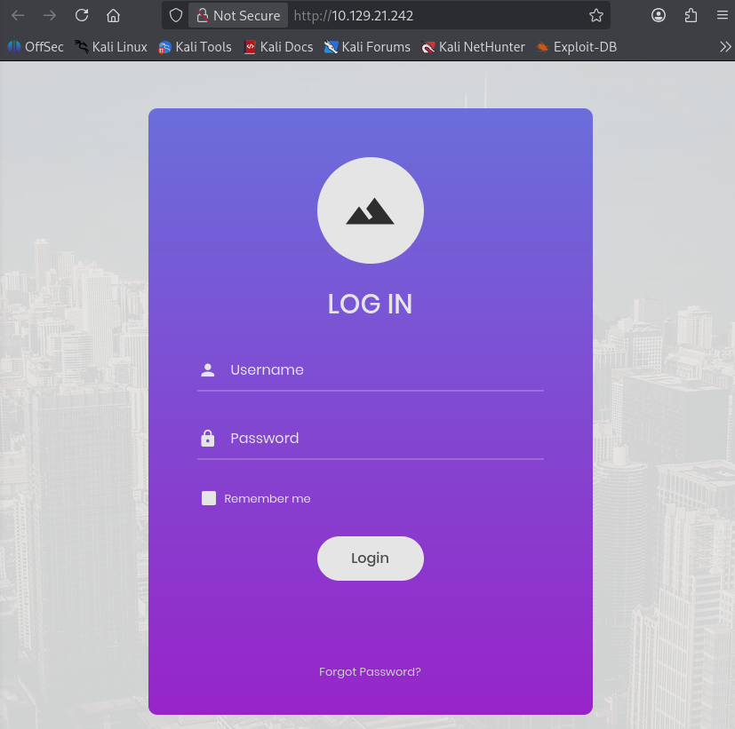
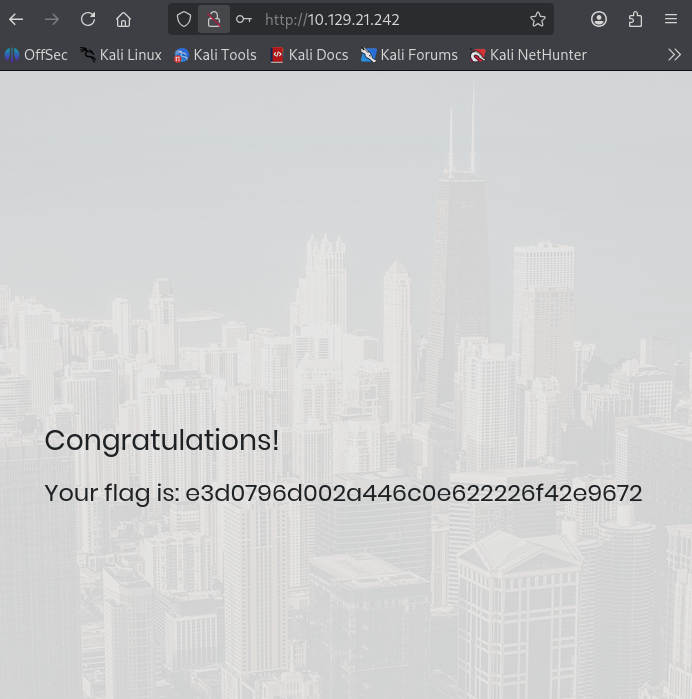

## Hack The Box — Appointment

## Initial Enumeration

An initial TCP port scan was performed to identify exposed services on the target machine.

**Command:**

```bash
nmap -sC -sV -O <TARGET_IP>
```

**Results:**

```
PORT   STATE SERVICE VERSION
80/tcp open  http    Apache httpd 2.4.38 ((Debian))
```

The scan revealed a single exposed service:

* **80/tcp** — HTTP (Apache httpd 2.4.38 on Debian)

The HTTP service hosted a login page, indicating a potential web-based attack surface.



---

## SQL Vulnerability Basics

Before exploitation, some fundamental questions regarding SQL vulnerabilities were answered.

* **SQL** stands for **Structured Query Language**
* One of the most common SQL vulnerabilities is **SQL Injection**
* According to the **OWASP Top 10 (2021)**, SQL Injection falls under:

  * **A03:2021 – Injection**

These findings suggested that the login functionality could be vulnerable to SQL Injection attacks.

---

## Web Application Enumeration

After identifying the HTTP service, the web application was accessed through a browser.

**URL:**

```
http://<TARGET_IP>
```

The web page presented a login form containing the following elements:

* Username field
* Password field
* “Remember Me” option
* “Forgot password” link

The presence of a login form indicated that user-supplied input was being processed by a backend database.



---

## Web Enumeration Concepts

Additional web enumeration concepts were identified:

* The standard port for HTTPS is **443**
* In web application terminology, a folder is referred to as a **directory**
* The HTTP response code for a "Not Found" error is **404**
* **Gobuster** can be used to brute-force directories using the **`dir`** mode

---

## SQL Injection Exploitation

The login form was vulnerable to SQL Injection due to improper input sanitization.

In MySQL, the `#` character can be used to comment out the rest of a SQL query. This behavior was leveraged to bypass authentication without knowing the administrator password.

**Payload used:**

* **Username:**

```sql
admin'#
```

* **Password:**

```
any value
```

This payload caused the password verification portion of the SQL query to be ignored, resulting in a successful login as the administrator.

Upon successful authentication, the application returned a page displaying a congratulatory message and revealed the flag.



---

## Flag

The flag was successfully retrieved after bypassing authentication via SQL Injection.

---

## Conclusion

This machine demonstrates a classic example of an authentication bypass caused by SQL Injection.

### Key security issues identified:

* Unsanitized user input in SQL queries
* Authentication logic vulnerable to SQL comments
* Lack of prepared statements or parameterized queries

### Lessons learned:

* Always validate and sanitize user input
* Use prepared statements to prevent SQL Injection
* Never trust client-side input for authentication logic

The **Appointment** machine provides a beginner-friendly introduction to SQL Injection and highlights how simple input validation failures can lead to full authentication bypass.
