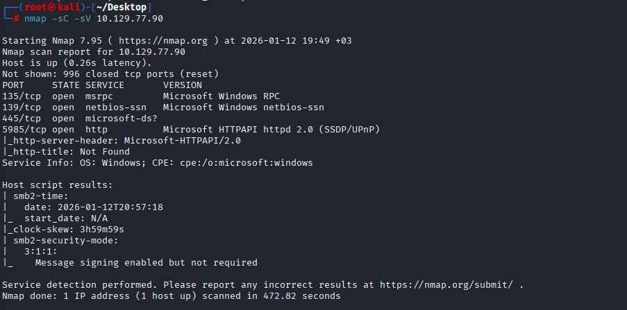
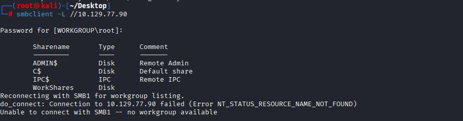
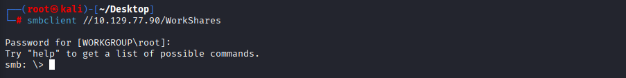
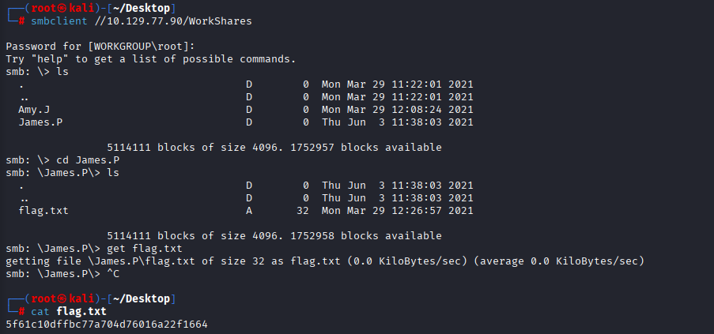

# Hack The Box — Dancing

## Initial Enumeration

An initial TCP port scan was performed to identify exposed services on the target machine.

**Command:**

```
nmap -sC -sV <TARGET_IP>
```

**Results:**
The scan revealed multiple open ports related to SMB and Windows services:

* **135/tcp** — Microsoft Windows RPC
* **139/tcp** — NetBIOS Session Service
* **445/tcp** — SMB (microsoft-ds)
* **5985/tcp** — Microsoft HTTPAPI (WinRM)

The presence of port **445** indicated that SMB file sharing was enabled on the target system.



---

## SMB Share Enumeration

SMB shares were enumerated using the `smbclient` utility to identify accessible network shares.

**Command:**

```
smbclient -L //<TARGET_IP>
```

**Results:**
Several default administrative shares were identified along with a custom share named **WorkShares**.



---

## SMB Anonymous Access

The **WorkShares** SMB share was accessible without authentication, allowing anonymous access.

**Command:**

```
smbclient //<TARGET_IP>/WorkShares
```

Upon connecting, multiple user directories were discovered inside the share.



---

## Flag Discovery

Further enumeration of the SMB share revealed user-specific directories. Inside one of these directories, a flag file was found.

The flag was successfully retrieved from the SMB share.



---

## Conclusion

This machine demonstrates the risks of exposing SMB shares with weak or missing authentication.

### Key security issues identified:

* SMB service exposed on port 445
* Anonymous access allowed to a shared directory
* Sensitive files accessible without authentication

### Lessons learned:

* Always restrict SMB shares to authenticated users
* Regularly audit file share permissions
* Disable unnecessary network services

The **Dancing** machine provides a beginner-friendly introduction to SMB enumeration and highlights how misconfigured file shares can lead to sensitive data exposure.
