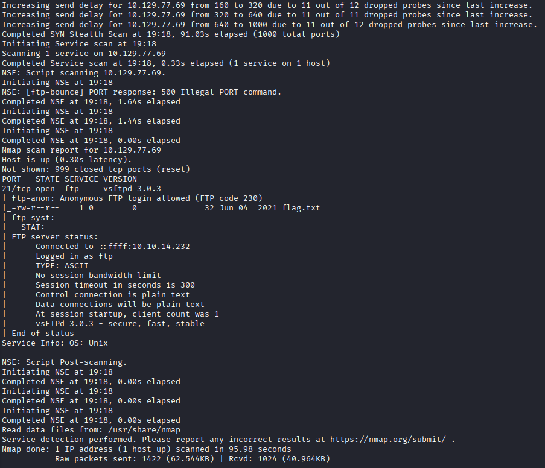
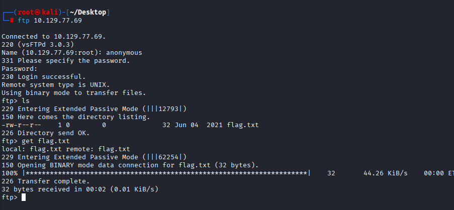

### Initial Enumeration
A TCP port scan was performed to identify exposed services on the target machine.

**Command:**
nmap -sC -sV -v <TARGET_IP>

The scan was executed using default NSE scripts and service version detection to gather initial information about running services.

**Results:**
The scan revealed a single open TCP port:
- 21/tcp — FTP (vsftpd 3.0.3)

Anonymous FTP login was enabled on the server, allowing unauthenticated access to the FTP service.

---

### FTP Access

The FTP service was accessed using anonymous credentials, which were allowed by the server configuration.

**Command:**
ftp <TARGET_IP>

**Login details:**
- Username: anonymous
- Password: blank

After logging in successfully, the contents of the FTP directory were listed and a file named `flag.txt` was discovered.

The flag file was downloaded from the server using the `get` command and successfully retrieved.

---

### Conclusion

This machine demonstrates a common misconfiguration where anonymous FTP access is enabled.  
By performing basic service enumeration and accessing the FTP service without authentication, it was possible to retrieve the flag without exploiting any vulnerabilities.

This highlights the importance of properly securing network services and disabling unnecessary anonymous access.

---

