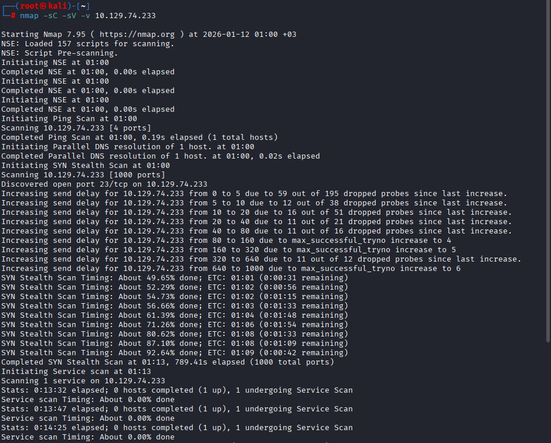
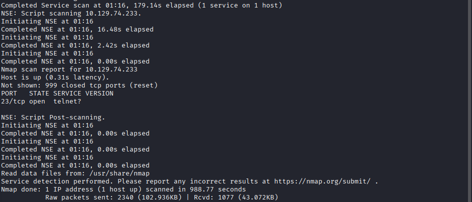
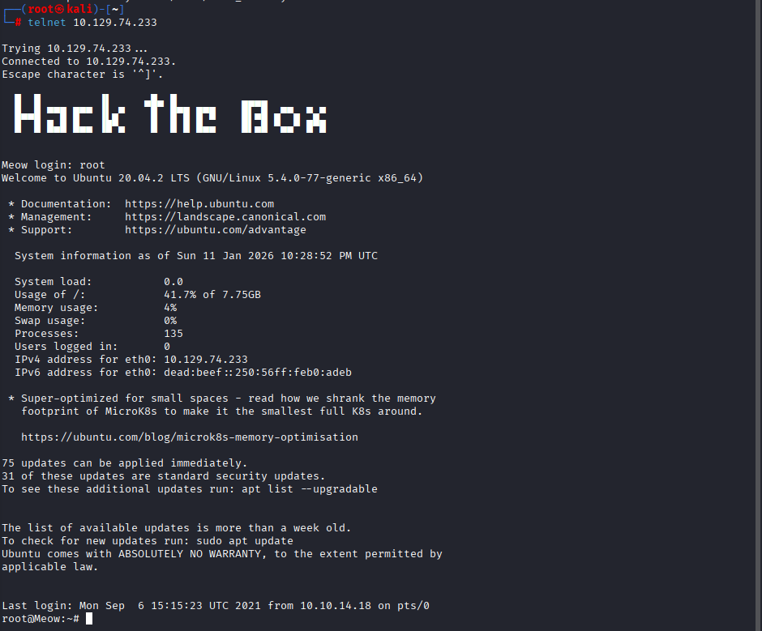
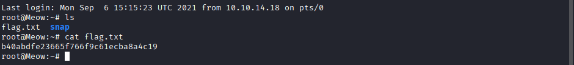

### Initial Enumeration
A TCP port scan was performed to identify exposed services on the target machine.

**Command:**
nmap -sC -sV -v <TARGET_IP>

The scan was executed using default NSE scripts and service version detection to gather initial information about running services.

**Results:**
The scan revealed a single open TCP port:
- 23/tcp — Telnet

All other ports were closed.

This indicates a very minimal attack surface with Telnet being the only exposed service.

---

### Telnet Authentication Bypass
After identifying Telnet as the only exposed service, the service was accessed for further enumeration.

**Command:**
telnet <TARGET_IP>

The Telnet service allowed authentication as the `root` user without requiring a password.  
This represents a critical authentication misconfiguration, as it provides immediate root-level access to the system.

Upon successful login, a root shell was obtained.

---

### Flag Discovery
After obtaining root-level access to the system via Telnet, the file system was inspected to locate the flag.

**Commands:**
ls
cat flag.txt

The flag was located in the root user's home directory and successfully retrieved.

---

### Conclusion
This machine demonstrated the risks of exposing insecure legacy services such as Telnet.

Key issues identified:
- Telnet service exposed on port 23
- Root user allowed to authenticate with a blank password
- Immediate root-level access without any exploitation required

This highlights the importance of:
- Disabling insecure protocols
- Enforcing strong authentication mechanisms
- Limiting direct root access

The Meow machine serves as a beginner-friendly example of how basic misconfigurations can lead to full system compromise.

