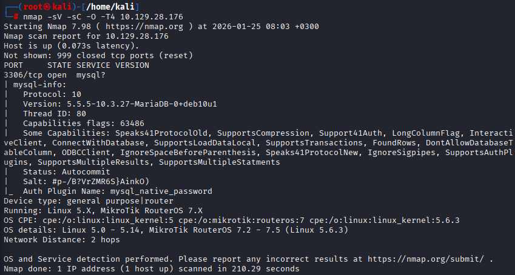
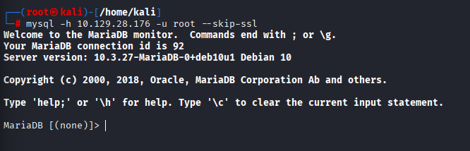
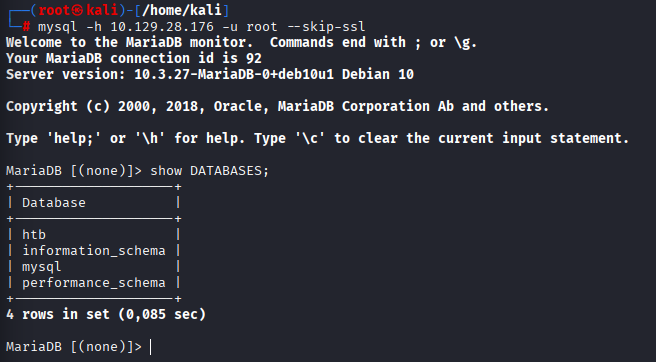
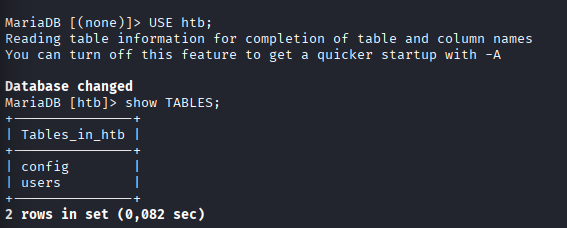
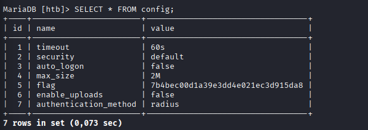

## Hack The Box — Sequel

## Initial Enumeration

A full TCP port scan was performed to identify exposed services on the target machine.

**Command:**

```bash
nmap -sV -sC -O -T4 10.129.28.176
````

**Command breakdown:**

* `-sC` — Run default Nmap scripts
* `-sV` — Service and version detection
* `-O` — Operating system detection
* `-T4` — Faster scan timing
* `10.129.28.176` — Target IP address

**Results:**

```
PORT     STATE SERVICE VERSION
3306/tcp open  mysql?
```

The scan revealed that the target exposes **only a MySQL service** to the network, which is an unusual and potentially insecure configuration.



---

## Database Service Enumeration

Further enumeration using Nmap’s `mysql-info` script provided detailed information about the exposed database service.

### Identified service details:

* **Port:** 3306/tcp
* **Service:** MySQL
* **Database Engine:** MariaDB
* **Version:** 10.3.27-MariaDB
* **Authentication Plugin:** `mysql_native_password`

MariaDB is a **community-developed fork of MySQL**. Exposing this service directly to the network significantly increases the attack surface if proper authentication and access controls are not enforced.

---

## MySQL / MariaDB Fundamentals

Before interacting with the service, several fundamental MySQL concepts were identified:

* **Default MySQL port:** `3306`
* **Community-developed MySQL fork:** `MariaDB`
* **MySQL client flag to specify a username:** `-u`
* **Wildcard to select all columns:** `*`
* **SQL query terminator:** `;`

---

## Authentication Attack Surface

One of the most common MySQL misconfigurations is allowing privileged users (such as `root`) to authenticate **without a password**.

Given that:

* The database service is publicly accessible
* No additional hardening was observed

An authentication attempt was made using common default credentials.

---

## MariaDB Authentication Bypass

An initial connection attempt failed due to an SSL/TLS mismatch between the client and the server:

```
ERROR 2026 (HY000): TLS/SSL error: SSL is required, but the server does not support it
```

This occurred because the MySQL client attempted to enforce SSL, while the MariaDB server did not support it.

To resolve this issue, SSL was explicitly disabled using a legacy client option.

**Command:**

```bash
mysql -h 10.129.28.176 -u root --skip-ssl
```

This resulted in a successful login **without providing a password**, confirming a critical authentication misconfiguration.



---

## Database Enumeration

After gaining access to the MariaDB instance, the available databases were enumerated.

**Command:**

```sql
SHOW DATABASES;
```

The output revealed four databases. Three of them are default system databases commonly present on MySQL installations:

* `information_schema`
* `mysql`
* `performance_schema`

One database was identified as **unique to this host**.

* **Target database:** `htb`



---

## Table Enumeration

The identified database was selected for further inspection.

**Command:**

```sql
USE htb;
```

The tables within the database were then listed:

```sql
SHOW TABLES;
```

This revealed two tables:

* `users`
* `config`



---

## Flag Extraction

The `users` table contained only user-related information and did not reveal the flag.
Further inspection of the `config` table exposed sensitive configuration data.

**Command:**

```sql
SELECT * FROM config;
```

This query revealed the flag stored within the database.



---

## Flag

The flag was successfully retrieved from the `config` table.

---

## Conclusion

The **Sequel** machine demonstrates the risks of exposing a database service directly to the network without proper security controls.

### Key security issues identified:

* MariaDB service exposed publicly
* `root` user allowed to authenticate without a password
* SSL/TLS not supported on the server
* Sensitive information stored in plaintext within database tables

### Lessons learned:

* Never expose database services to untrusted networks
* Enforce strong authentication for privileged users
* Ensure proper SSL/TLS configuration
* Restrict database access using firewall rules and bind addresses
